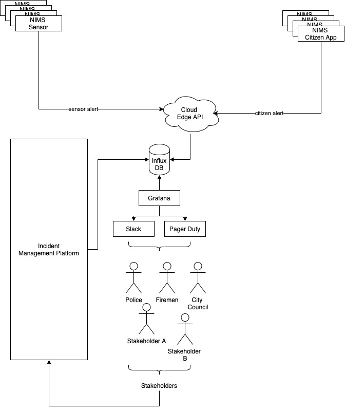

# NIMS: National Incident Management System
NIMS: a platform based on the devOps philosophy to trigger alerts when incidents or natural catastrophes occur and manage relief efforts at country level.

## Overview

